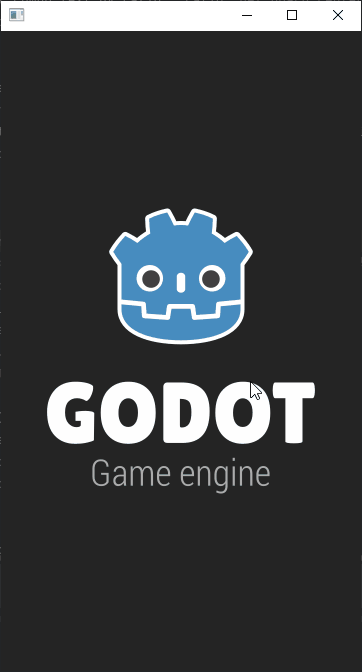
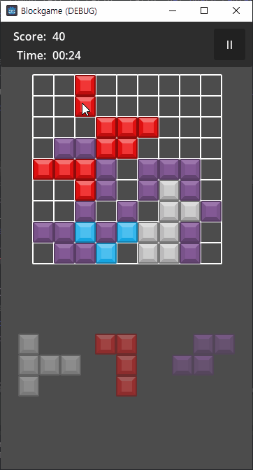

# blockgame

this project is typical block placement game development project using godot engine.

i focused on functional implementation, and since I'm learning godot engines, gdscript or implementation may not be professional.

so i hope you understand if there is anything wrong with the project, and i hope this project helps someone this project even though it's not good enough.

best regards.

# requirements

- godot 4.2.1 (https://godotengine.org/)

# screenshots

# resource license information
all graphic and audio resource from https://kenney.nl/
